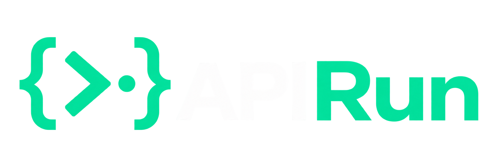
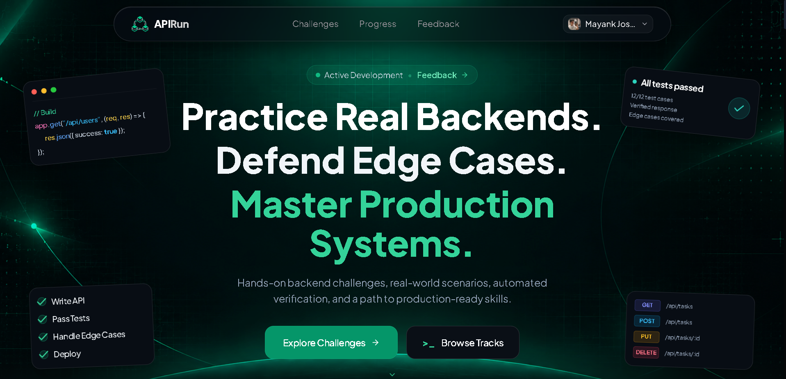
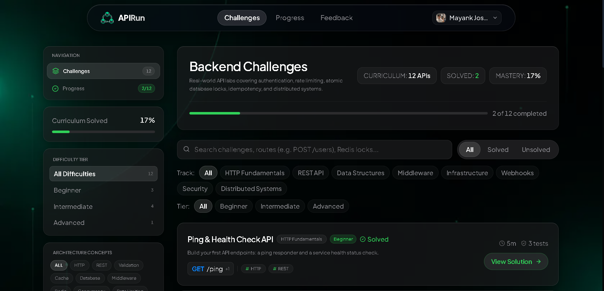
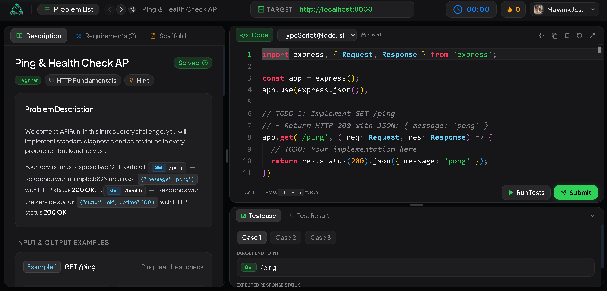
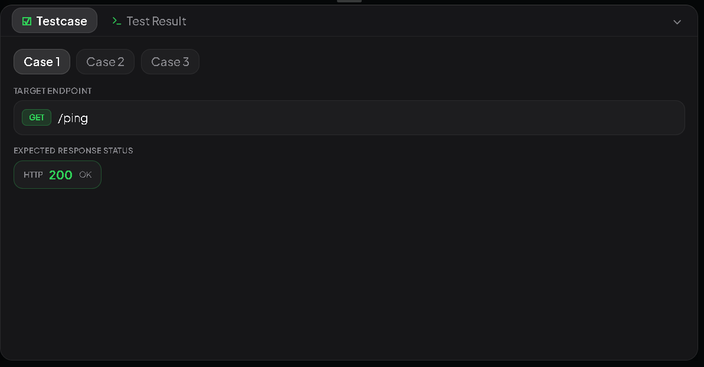
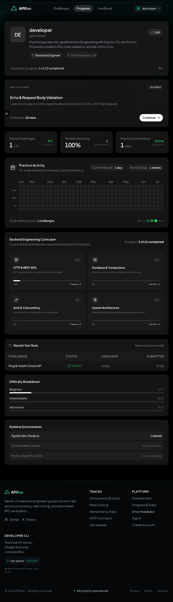
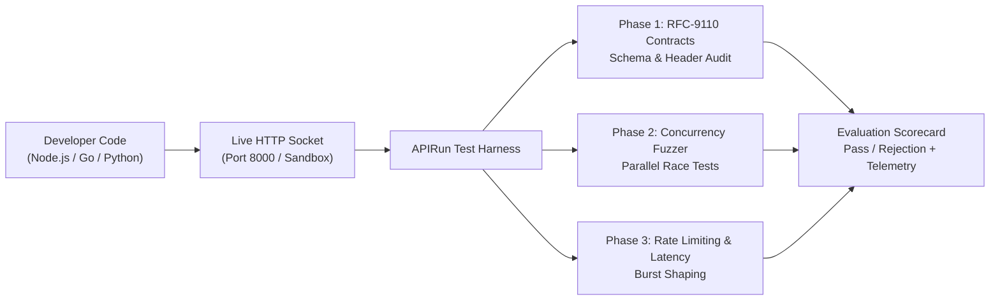

<div align="center">



# APIRun

### **What if LeetCode existed for Backend Engineers?**
*Because at 3:00 AM, production systems don't crash on inverted binary trees — they crash on race conditions, exhausted connection pools, and non-idempotent payment retries.*

<br/>

[](https://nextjs.org/)
[](https://react.dev/)
[](https://www.typescriptlang.org/)
[](https://tailwindcss.com/)
[](https://microsoft.github.io/monaco-editor/)
[](LICENSE)

<br/>

[The Manifesto](#-the-manifesto-the-great-disconnect) • [Platform Walkthrough](#-platform-walkthrough) • [How Evaluation Works](#-how-the-apirun-runner-evaluates-your-code) • [Curriculum Tracks](#-backend-curriculum-tracks) • [Dual Execution Modes](#-dual-execution-modes) • [Quickstart](#-getting-started)

</div>

---

## 💥 The Manifesto: The Great Disconnect

For the past decade, technical interviews and coding platforms have trained millions of software engineers to solve synthetic, single-threaded puzzle algorithms:

> *"Given an array of integers, return indices of the two numbers such that they add up to target."*  
> *"Invert a binary tree in $O(N)$ time."*  
> *"Find the longest increasing path in a matrix."*

While valuable for algorithmic fundamentals, **this has almost zero resemblance to modern backend engineering.**

When you join a backend team on Day 1, you aren't writing dynamic programming tables in `stdin`. You are building distributed HTTP services, defending mutable database state, and handling network partitions:

```
❌ LeetCode Puzzle:  "Find the maximum subarray sum in O(N)."
🚨 Backend Reality:   50 simultaneous checkout webhooks just hit your billing endpoint 
                      with the exact same idempotency key during a Redis cache failover.
                      Did you charge the customer 50 times?
```

| Evaluation Vector | Traditional Algorithmic Platforms (LeetCode) | APIRun (Backend Engineering Arena) |
| :--- | :--- | :--- |
| **Execution Sandbox** | Isolated, single-threaded function `solution(nums: int[])` | Live HTTP web server listening on an active socket |
| **Concurrency & Race Conditions** | ❌ None. Deterministic synchronous calls | 💥 **Automated burst fuzzer**: Fires 50+ concurrent requests to expose race conditions and double-spends |
| **Contract Semantics** | Integer or string exact equality | 🛡️ **RFC-9110 HTTP Audits**: Header negotiation, schema validation, and strict error status codes |
| **Failures & Resilience** | Returns wrong boolean or timeout | ⏳ Real `429 Too Many Requests`, `409 Conflict`, idempotency key deduping, and jitter backoff |
| **Data Integrity** | Arrays, Linked Lists, Binary Trees | 🗄️ Atomic row locks, token bucket rate limiters, distributed mutexes, and HMAC signatures |
| **Development Experience** | Locked cloud editor with synthetic I/O | 💻 **Dual Mode**: Code in-browser Monaco IDE **or** test your own local server (`http://localhost:8000`) |

---

## 📸 Platform Walkthrough

<div align="center">

### 1. High-Performance Obsidian Landing Experience
*Interactive language tickers, production metrics, and focused architectural narrative.*



<br/><br/>

### 2. Real-World Backend Challenge Catalog
*Curriculum structured around actual production domains: HTTP Fundamentals, Concurrency, Database Transactions, and Distributed Systems.*



<br/><br/>

### 3. The Workbench & Live Test Arena
*Full Monaco IDE featuring live target proxying (`http://localhost:8000`), interactive RFC specs, and multi-testcase console dock.*



<br/><br/>

### 4. Precision Evaluation & Fuzzing Harness
*De-slopped Apple-inspired evaluation modal with spring physics, test breakdown, and total runtime latency telemetry.*



<br/><br/>

### 5. Developer Mastery, Activity Heatmap & Progress Spiral
*Dynamic greeting, 52-week activity heatmap, 2x2 domain competencies grid, and an interactive Archimedean curriculum spiral.*



</div>

---

## ⚡ How the APIRun Runner Evaluates Your Code

When you click **Submit Solution** or **Run Tests**, APIRun does not simply run an `eval()` on your script. It treats your code like a production microservice:



1. **Phase 1: RFC-9110 Contract Verification**  
   Sends valid and malformed requests across `GET`, `POST`, `PUT`, `DELETE`. Verifies that invalid JSON bodies return appropriate `400 Bad Request` structures instead of crashing with unhandled exceptions (`500 Internal Server Error`).
2. **Phase 2: High-Concurrency Burst Fuzzing**  
   Dispatches dozens of concurrent asynchronous HTTP clients simultaneously hitting shared resources (e.g. account balances, ticket inventories, distributed locks) to catch non-atomic operations and double-spend race conditions.
3. **Phase 3: Traffic Shaping & Idempotency Audits**  
   Validates sliding-window and token-bucket algorithms by blasting requests past quota limits, asserting that `429 Too Many Requests` is returned with compliant `Retry-After` headers and exact capacity replenishment.
4. **Phase 4: Telemetry & Benchmark Audit**  
   Calculates total execution runtime and p99 response times to ensure endpoints meet sub-20ms SLAs.

---

## 🎯 Backend Curriculum Tracks

APIRun challenges are organized into four core backend specializations:

### 1. 🌐 HTTP & REST Contracts
- **Ping & Diagnostic Probes**: Implement standard container orchestration health checks (`/ping`, `/health`).
- **Strict Payload Validation**: Parse JSON request bodies, enforce required fields and types, and reject malformed schemas.
- **Content Negotiation & Headers**: Handle `Accept`, `Content-Type`, and conditional cache headers (`ETag`, `304 Not Modified`).

### 2. ⚡ Concurrency & Transaction Safety
- **Atomic Balance Transfers**: Prevent double-spending when concurrent debits hit the same account balance simultaneously.
- **Idempotency Keys**: Guarantee that network retries on POST mutation endpoints execute business logic exactly once.
- **Distributed Mutexes**: Coordinate access to critical sections across distributed nodes.

### 3. ⏱️ Rate Limiting & Traffic Shaping
- **Token Bucket Algorithms**: Allow momentary bursts of traffic while enforcing strict sustained capacity limits.
- **Sliding Window Counters**: Eliminate the double-quota boundary exploit common in naive fixed-window limiters.
- **Standardized RFC Decorators**: Return `X-RateLimit-Limit`, `X-RateLimit-Remaining`, and `Retry-After` headers.

### 4. 🔐 Security, Auth & Systems
- **Stateless JWT Rotation**: Cryptographic token signing, expiration validation, and refresh token exchange.
- **HMAC Webhook Signatures**: Verify SHA-256 signatures on inbound webhooks to prevent spoofing and replay attacks.
- **Role-Based Access Control (RBAC)**: Enforce hierarchical permission middleware across sensitive routes.

---

## 💻 Dual Execution Modes

### Mode A: Zero-Install In-Browser Sandbox
Start coding in seconds using the built-in **Monaco Editor** (the engine powering VS Code). Switch between **TypeScript (Node.js)**, **Go**, and **Python**. Run assertions and view output directly inside the console dock with zero local setup.

### Mode B: "Bring Your Own Server" (BYOS)
Prefer your local setup with Neovim, VS Code, or GoLand?
1. Start your local server on your machine (e.g., `http://localhost:8000`).
2. Enter `http://localhost:8000` into the Target URL pill in APIRun.
3. Click **Run Tests** — APIRun's test harness will connect directly to your local server and bombard it with the full fuzzing test suite!

---

## 🛠️ Supported Runtimes & Frameworks

| Runtime / Ecosystem | Frameworks & Libraries |
| :--- | :--- |
| **TypeScript / Node.js** | Express, Fastify, Hono, NestJS, Bun |
| **Go** | Standard Library `net/http`, Gin, Fiber, Chi |
| **Python** | FastAPI, Starlette, Flask, AsyncIO |
| **Rust** | Axum, Actix-web, Tokio |
| **Java / Kotlin** | Spring Boot, Quarkus, Ktor |
| **C# / .NET** | ASP.NET Core Minimal APIs |

---

## 🏗️ Tech Stack & Architecture

- **Framework**: [Next.js 16](https://nextjs.org/) (Turbopack, App Router)
- **Frontend Core**: [React 19](https://react.dev/), [TypeScript 5.7](https://www.typescriptlang.org/)
- **Design Philosophy**: Apple-inspired Obsidian Dark Glassmorphism (tactile springs, subtle border speculars, zero AI-slop)
- **Styling**: [Tailwind CSS 3.4](https://tailwindcss.com/)
- **Code Editor**: [@monaco-editor/react](https://github.com/suren-atoyan/monaco-react)
- **Persistence & Telemetry**: [Firebase Firestore](https://firebase.google.com/) for submission histories and activity heatmaps
- **Authentication**: [Clerk](https://clerk.com/)

---

## 📦 Getting Started

### Prerequisites
- **Node.js**: `v18.18+` or `v20+`
- **npm**, **pnpm**, or **yarn**

### Quick Installation

```bash
# 1. Clone the repository
git clone https://github.com/MayankJoshi540/ApiRun.git
cd ApiRun

# 2. Install dependencies
npm install

# 3. Configure environment variables
cp .env.example .env.local
```

### Environment Variables
Configure your credentials in `.env.local`:

```env
# Clerk Authentication
NEXT_PUBLIC_CLERK_PUBLISHABLE_KEY=pk_test_...
CLERK_SECRET_KEY=sk_test_...

# Firebase Telemetry & Profiles
NEXT_PUBLIC_FIREBASE_API_KEY=your_firebase_key
NEXT_PUBLIC_FIREBASE_AUTH_DOMAIN=your_project.firebaseapp.com
NEXT_PUBLIC_FIREBASE_PROJECT_ID=your_project_id
NEXT_PUBLIC_FIREBASE_STORAGE_BUCKET=your_project.firebasestorage.app
NEXT_PUBLIC_FIREBASE_MESSAGING_SENDER_ID=your_sender_id
NEXT_PUBLIC_FIREBASE_APP_ID=your_app_id
```

### Run Locally

```bash
npm run dev
```

Open **[`http://localhost:3000`](http://localhost:3000)** in your browser and start building resilient backend systems.

---

## 📂 Project Architecture

```
APIRun/
├── public/
│   ├── screenshots/              # High-res platform screenshots
│   │   ├── homepage.png          # Landing page overview
│   │   ├── challenges.png        # Production challenge catalog
│   │   ├── workbench.png         # Monaco workbench & live console
│   │   ├── evaluation.png        # Precision test evaluation modal
│   │   └── progress.png          # Developer heatmap & curriculum spiral
│   ├── backgrounds/              # Ambient canvas artworks
│   │   ├── background.png        # Landing hero canvas
│   │   ├── challenges-bg.png     # Challenges ambient canvas
│   │   └── progress-background.png # Progress ambient canvas
│   ├── currosel/                 # Platform carousel showcases
│   └── logo.png                  # APIRun brand emblem
├── src/
│   ├── app/                      # Next.js App Router
│   │   ├── page.tsx              # Landing experience
│   │   ├── challenges/           # Challenge catalog & live IDE runner
│   │   ├── progress/             # Developer mastery, heatmap & spiral
│   │   └── feedback/             # Community feedback channel
│   ├── components/               # UI Component System
│   │   ├── ProgressSpiral.tsx    # Interactive Apple-style Archimedean spiral
│   │   ├── SubmissionHeatmap.tsx # 52-week activity heatmap
│   │   ├── ChallengeDetailView.tsx # Split-pane responsive workbench
│   │   ├── CodeEditorPanel.tsx   # Monaco editor with Xcode/Apple theme
│   │   ├── LeetCodeConsoleDock.tsx # Bottom test result & testcase dock
│   │   ├── SubmissionModal.tsx   # Tactile evaluation modal with spring physics
│   │   └── ui/Skeleton.tsx       # Hardware-accelerated obsidian skeleton loaders
│   ├── data/                     # Challenge fixtures, test specs & starter code
│   └── lib/                      # Firebase Firestore & telemetry utilities
└── package.json
```

---

## 🤝 Contributing

We welcome contributions from engineers worldwide! Whether you want to contribute a new challenge spec (e.g. Redis Stream consumer groups, Kafka idempotency, OAuth2 PKCE), refine the test runner fuzzer, or enhance UI physics:

1. **Fork** the repository
2. **Create** your feature branch (`git checkout -b feature/redis-stream-challenge`)
3. **Commit** your changes (`git commit -m 'feat: add Redis Stream consumer group challenge'`)
4. **Push** to your branch (`git push origin feature/redis-stream-challenge`)
5. **Open** a Pull Request

---

## 📄 License

Distributed under the **MIT License**. See [`LICENSE`](LICENSE) for details.

<div align="center">
<sub>Built for engineers who care about what happens when real traffic hits their servers.</sub>
</div>
