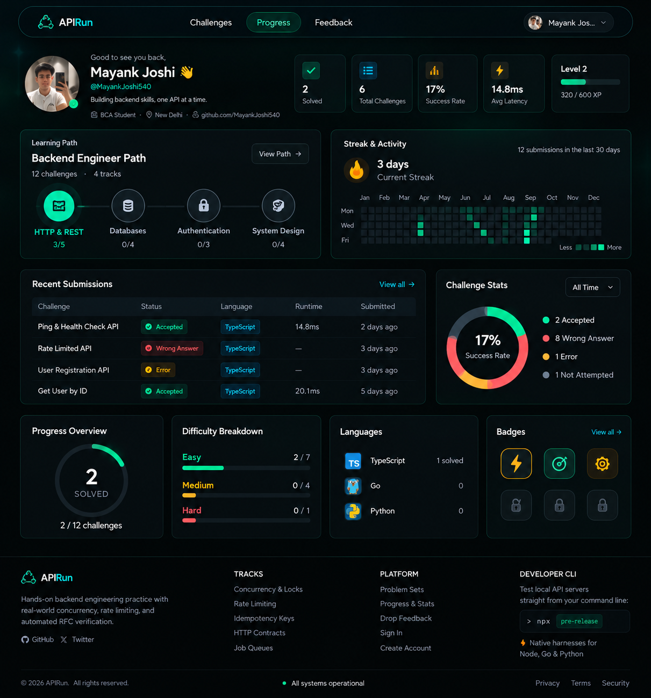
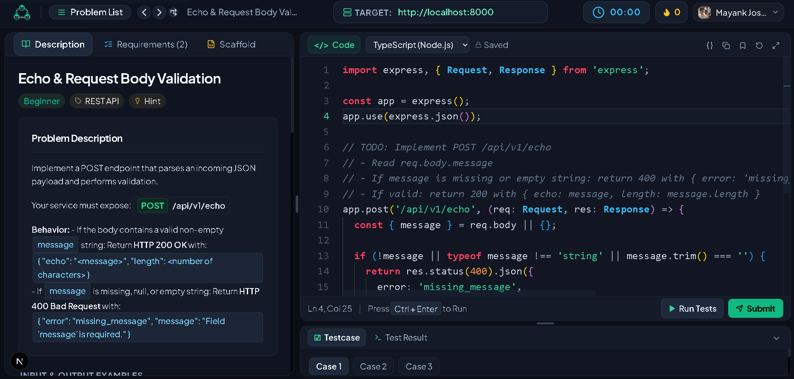
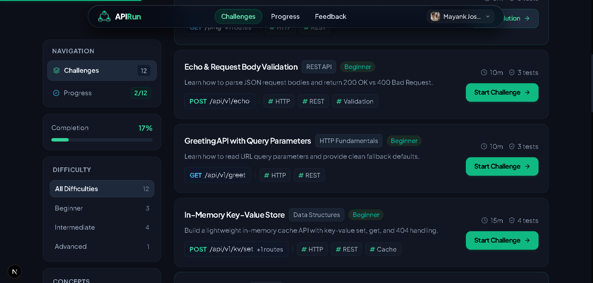

<div align="center">


# APIRun

### **The Interactive Arena for Production-Grade Backend Engineering**
*Because in production, systems don't fail on binary tree inversions — they fail on race conditions, connection starvation, and non-idempotent payment retries.*

<br/>

[](https://nextjs.org/)
[](https://react.dev/)
[](https://www.typescriptlang.org/)
[](https://tailwindcss.com/)
[](https://microsoft.github.io/monaco-editor/)
[](LICENSE)

<br/>

[Live Experience](#-the-paradigm-shift) • [Interactive Showcase](#-visual-tour) • [Core Pillars](#-what-makes-apirun-different) • [Curriculum Tracks](#-engineering-tracks) • [Quickstart](#-getting-started)

</div>

---

## ⚡ The Paradigm Shift

Traditional coding platforms focus primarily on abstract algorithmic puzzles (inverting binary trees, dynamic programming grids, graph traversals). While valuable for algorithmic fundamentals, they don't prepare developers for production backend systems.

Most competitive programming sites evaluate developers in synthetic bubbles: single-threaded standard I/O, synchronous deterministic calls, and contrived puzzle algorithms. 

**Backend reality is fundamentally different:**

```
Traditional Puzzle: Given an array, find the maximum subarray sum.
Production Reality:   50 simultaneous webhook retries just hit your billing endpoint 
                      with the same idempotency key while your cache expired. 
                      Did you double-charge the customer?
```

**APIRun** is purpose-built to test and hone the engineering skills required to run software at scale. You build real HTTP services in **Node.js, Go, or Python**, and APIRun subjects them to live automated fuzzing suites, RFC compliance audits, burst concurrency stress tests, and edge-case probes.

---

## 🖼️ Visual Tour

<div align="center">

### 1. High-Performance Landing Experience
*Obsidian glass aesthetics, dynamic language tickers, and clear production-focused messaging.*


<br/><br/>

### 2. Real-World Backend Challenges Catalog
*Filter across HTTP Fundamentals, Distributed Systems, Transaction Locks, and Security Tiers.*



<br/><br/>

### 3. The Workbench & Live Test Arena
*Full Monaco IDE featuring live target proxying (`http://localhost:8000`), contract specs, and integrated testcase console.*



<br/><br/>

### 4. Precision Evaluation & Fuzzing Harness
*De-slopped Apple-style feedback modal with spring physics, hidden edge-case audits, and microsecond latency telemetry.*



</div>

---

## 🛡️ What Makes APIRun Different?

| Dimension | Typical Algorithmic Sites | APIRun |
| :--- | :--- | :--- |
| **Execution Model** | Isolated `stdin` / `stdout` sandbox | Live HTTP server endpoints listening on active ports |
| **Concurrency Testing** | ❌ None (Single-threaded) | ✅ **Automated burst fuzzer**: Dispatches parallel requests to expose non-atomic state mutations |
| **Contract Verification** | Exact string or integer equality | ✅ **RFC-9110 HTTP Audits**: Header validation, status code semantics, and payload schema guards |
| **Failure Modes** | Wrong answer on index `i` | ✅ Real 429 rate limit triggers, 409 conflict states, and cache expiration race conditions |
| **Local Interop** | Cloud-only locked editor | ✅ **Dual Mode**: Code in-browser OR point the test runner to your local machine (`http://localhost:8000`) |

---

## 🎯 Engineering Tracks

APIRun organizes hands-on problems into four core backend disciplines:

### 1. 🌐 HTTP & REST Contracts
*Master status code semantics, header negotiation, schema validations, and standard health probes.*
- **Ping & Health Probes**: Implement RFC diagnostic endpoints (`/ping`, `/health`).
- **Strict Request Validation**: Enforce JSON schema contracts and gracefully reject malformed payloads with informative `400 Bad Request` structures.
- **Header Audits & Content Negotiation**: Manage `Accept`, `Content-Type`, and standard ETag conditional requests (`304 Not Modified`).

### 2. ⚡ Concurrency & Transaction Safety
*Defend your architecture against race conditions and concurrent mutation attacks.*
- **Idempotent Mutation Keys**: Guarantee that duplicated network retries do not double-process mutations.
- **Atomic Balance Transfers**: Solve the classic double-spend vulnerability with transactional locks and optimistic concurrency.
- **Distributed Mutexes**: Coordinate shared resources safely across clustered instances.

### 3. ⏱️ Rate Limiting & Traffic Shaping
*Protect downstream databases and backends from cascading stampedes.*
- **Token Bucket Limiters**: Allow brief traffic bursts while enforcing strict sustained capacity limits.
- **Sliding Window Counters**: Eliminate edge boundary bursts common in naive fixed-window limiters.
- **RFC Header Decorators**: Return standard `Retry-After`, `X-RateLimit-Remaining`, and `429 Too Many Requests` headers.

### 4. 🔐 Security, Auth & Sessions
*Production-grade authentication and perimeter security.*
- **Stateless JWT Rotation**: Token refreshing, signature verification, and replay defense.
- **Role-Based Access Control (RBAC)**: Fine-grained permission trees with middleware interception.
- **Webhook Signature Verification**: Cryptographic HMAC signature verification on inbound webhooks.

---

## 💻 Code Anywhere: Dual Execution Modes

### Mode A: In-Browser Monaco IDE
Code right in your browser with the same core engine that powers **VS Code**. Switch seamlessly between **TypeScript / Node.js**, **Go**, and **Python**. Click **Run Tests** to see sub-second evaluation directly in the bottom dock.

### Mode B: "Bring Your Own Server" (BYOS)
Already have your preferred local workflow with Neovim, VS Code, or GoLand?
1. Start your local server on your machine (e.g., `http://localhost:8000`).
2. Type `http://localhost:8000` into the target URL pill inside APIRun.
3. Click **Run Tests** or **Submit Solution** — APIRun's test harness will bombard your real running server with the full test and fuzzing suite!

---

## 🏗️ Architecture & Tech Stack

- **Core Framework**: [Next.js 16](https://nextjs.org/) (Turbopack, App Router)
- **UI & Components**: [React 19](https://react.dev/), [TypeScript 5.7](https://www.typescriptlang.org/)
- **Design Philosophy**: Apple-inspired Obsidian Glassmorphism (subtle borders, layered blurs, tactile spring physics)
- **Styling**: [Tailwind CSS](https://tailwindcss.com/)
- **Editor**: [@monaco-editor/react](https://github.com/suren-atoyan/monaco-react)
- **State & Persistence**: [Firebase Firestore](https://firebase.google.com/) for submission histories and live telemetry
- **Authentication**: [Clerk](https://clerk.com/)

---

## 🚀 Getting Started

### Prerequisites
- **Node.js**: `v18.18+` or `v20+`
- **npm**, **pnpm**, or **yarn**

### Quick Installation

```bash
# 1. Clone the repository
git clone https://github.com/MayankJoshi540/ApiRun.git
cd ApiRun

# 2. Install dependencies
npm install

# 3. Create your local environment file
cp .env.example .env.local
```

### Environment Variables
Configure your credentials in `.env.local`:

```env
# Clerk Authentication
NEXT_PUBLIC_CLERK_PUBLISHABLE_KEY=pk_test_...
CLERK_SECRET_KEY=sk_test_...

# Firebase Telemetry & Profiles
NEXT_PUBLIC_FIREBASE_API_KEY=your_firebase_key
NEXT_PUBLIC_FIREBASE_AUTH_DOMAIN=your_project.firebaseapp.com
NEXT_PUBLIC_FIREBASE_PROJECT_ID=your_project_id
NEXT_PUBLIC_FIREBASE_STORAGE_BUCKET=your_project.firebasestorage.app
NEXT_PUBLIC_FIREBASE_MESSAGING_SENDER_ID=your_sender_id
NEXT_PUBLIC_FIREBASE_APP_ID=your_app_id
```

### Run Locally

```bash
npm run dev
```

Visit **[`http://localhost:3000`](http://localhost:3000)** in your browser and start building resilient backend systems.

---

## 📂 Project Structure

```
APIRun/
├── public/                       # Static branding & platform screenshot assets
│   ├── reference.png             # Landing page overview
│   ├── new-editor.png            # Challenge arena screenshot
│   ├── new-catalog.png           # Mastery dashboard screenshot
│   └── logo.png                  # APIRun platform logo
├── src/
│   ├── app/                      # Next.js App Router
│   │   ├── page.tsx              # High-conversion landing experience
│   │   ├── challenges/           # Challenge catalog & live IDE runner
│   │   ├── progress/             # Developer mastery & activity heatmap
│   │   └── feedback/             # Community feedback channel
│   ├── components/               # UI Component System
│   │   ├── ChallengeDetailView.tsx # Split-pane responsive workbench
│   │   ├── CodeEditorPanel.tsx   # Monaco editor with Xcode/Apple theme
│   │   ├── LeetCodeConsoleDock.tsx # Bottom test result & testcase dock
│   │   ├── SubmissionModal.tsx   # De-slopped evaluation modal with spring physics
│   │   ├── SubmissionHeatmap.tsx # Full 52-week high-density activity heatmap
│   │   └── AppNavbar.tsx         # Floating obsidian navigation bar
│   ├── data/                     # Challenge fixtures, test specs & starter code
│   └── lib/                      # Firebase Firestore & telemetry utilities
└── package.json
```

---

## 🤝 Contributing

We welcome contributions from engineers across all backgrounds! Whether you want to author a new challenge spec (e.g. Redis stream processing, Kafka idempotency, OAuth2 PKCE), improve the test runner fuzzer, or enhance UI physics:

1. **Fork** the repository
2. **Create** your feature branch (`git checkout -b feature/redis-lock-challenge`)
3. **Commit** your changes (`git commit -m 'feat: add Redis distributed lock challenge spec'`)
4. **Push** to your branch (`git push origin feature/redis-lock-challenge`)
5. **Open** a Pull Request

---

## 📄 License

Distributed under the **MIT License**. See [`LICENSE`](LICENSE) for details.

<div align="center">
<sub>Crafted with passion for backend engineers who build systems that don't crash under pressure.</sub>
</div>
